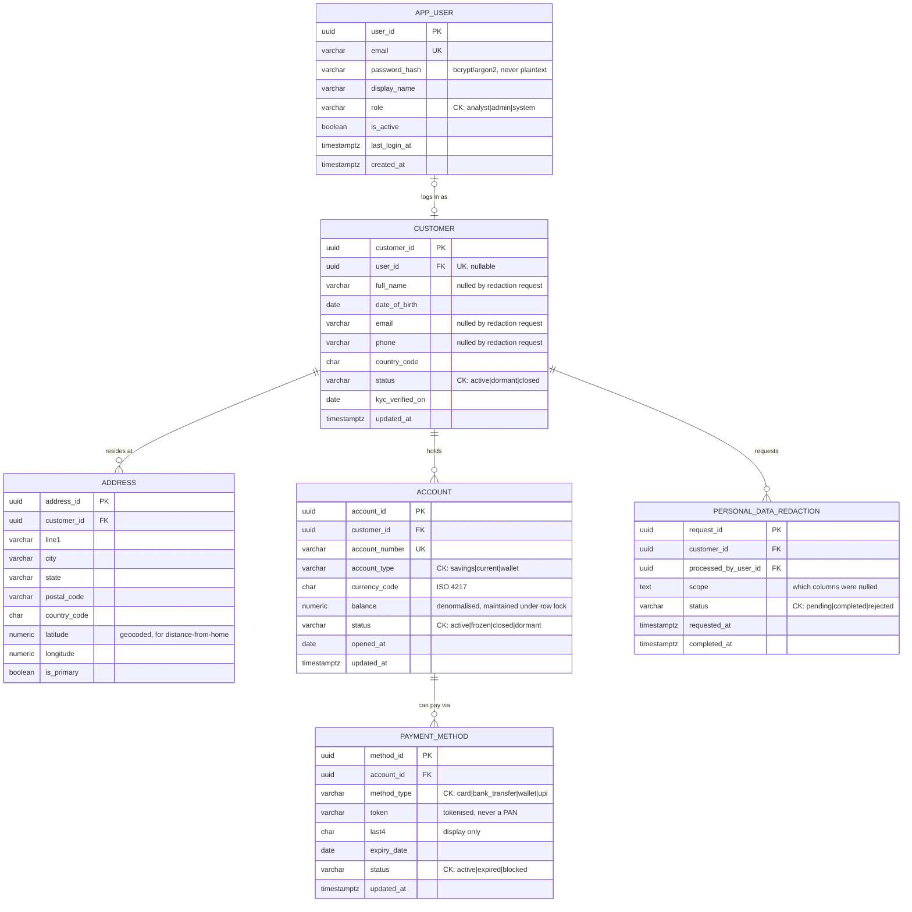
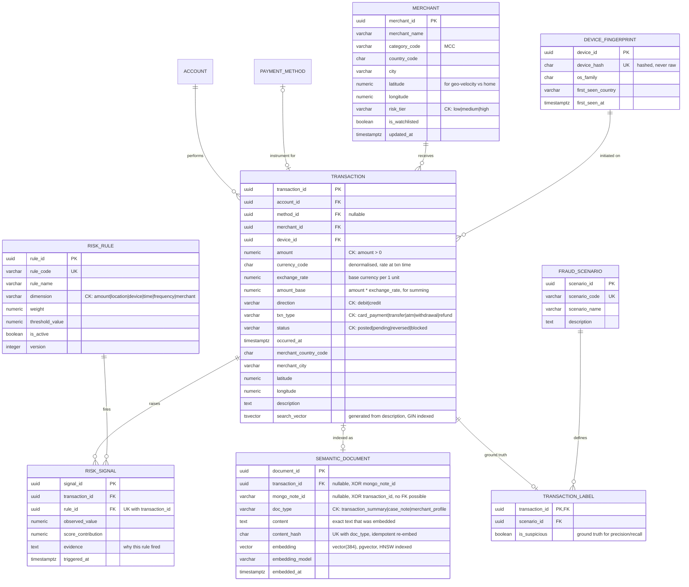
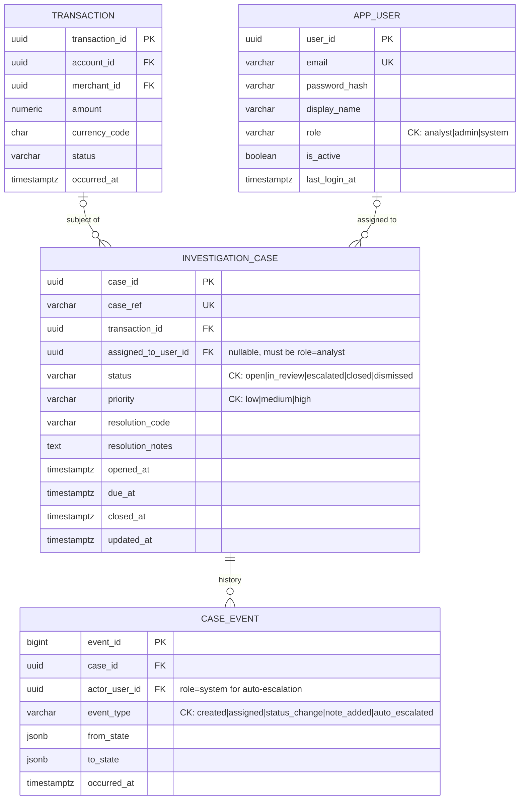

# FinSight — ER Diagram

Three figures for the report, plus the DDL objects an ER diagram cannot show.
Single-source full version: [`er-diagram.mmd`](./er-diagram.mmd) · true UML: [`er-diagram.puml`](./er-diagram.puml)

---

## Figure 1 — Identity & Banking



## Figure 2 — Transactions & Risk Engine



## Figure 3 — Investigation Workflow



---

## DDL objects an ER diagram cannot show

An ER diagram documents *structure*. The graded requirements in PDF item #7 are largely about
*behaviour* — triggers, functions, views, indexes, privileges. These belong in the report too.

### Indexes

```sql
-- Full-text search over transaction descriptions (PDF #7: full-text search)
CREATE INDEX idx_transaction_search ON transaction USING GIN (search_vector);

-- Vector similarity (PDF #7: vector similarity search)
CREATE INDEX idx_semantic_document_embedding
  ON semantic_document USING HNSW (embedding vector_cosine_ops);

-- One open case per transaction. Re-opening after closure stays legal.
CREATE UNIQUE INDEX uq_case_open_per_transaction
  ON investigation_case (transaction_id)
  WHERE status NOT IN ('closed', 'dismissed');

-- A rule cannot score the same transaction twice
CREATE UNIQUE INDEX uq_risk_signal_per_rule
  ON risk_signal (transaction_id, rule_id);

-- Idempotent re-embedding
CREATE UNIQUE INDEX uq_semantic_document_content
  ON semantic_document (doc_type, content_hash);

-- Transaction explorer: filter by account, newest first
CREATE INDEX idx_transaction_account_time
  ON transaction (account_id, occurred_at DESC);

-- Append-only, time-ordered table — BRIN is far smaller than B-tree here
CREATE INDEX idx_transaction_occurred_brin
  ON transaction USING BRIN (occurred_at);
```

Every foreign key needs an index. PostgreSQL does **not** create these automatically, and a missing
one is the single easiest thing to demonstrate `EXPLAIN ANALYZE` on.

### Triggers

| Trigger | Table | Event | Purpose |
|---|---|---|---|
| `trg_case_event_immutable` | `case_event` | `BEFORE UPDATE OR DELETE` | `RAISE EXCEPTION` — makes append-only real |
| `trg_case_audit` | `investigation_case` | `AFTER INSERT OR UPDATE` | Writes a `case_event` row automatically |
| `trg_redact_customer_pii` | `personal_data_redaction` | `AFTER UPDATE` | Nulls PII columns when a request completes |
| `trg_touch_updated_at` | all mutable tables | `BEFORE UPDATE` | Sets `updated_at` |
| `trg_guard_balance` | `account` | `BEFORE UPDATE` | Refuses `balance < 0` |

### Views

`risk_score` and `risk_level` live **here**, not as columns. This is what makes the engine
explainable: the score is always derivable from the signals that produced it.

```sql
-- Aggregate score per transaction, banded into a level
CREATE VIEW v_transaction_risk AS
SELECT
  s.transaction_id,
  SUM(s.score_contribution)                       AS risk_score,
  CASE
    WHEN SUM(s.score_contribution) >= 80 THEN 'critical'
    WHEN SUM(s.score_contribution) >= 60 THEN 'high'
    WHEN SUM(s.score_contribution) >= 35 THEN 'medium'
    ELSE 'low'
  END                                             AS risk_level,
  COUNT(*)                                        AS signal_count
FROM risk_signal s
GROUP BY s.transaction_id;
```

| View | Answers |
|---|---|
| `v_transaction_risk` | Aggregate risk score and level, with signal count |
| `v_customer_spending_summary` | Per-customer totals, averages, and transaction count |
| `v_merchant_risk_profile` | Merchant risk tier against observed signal rate |
| `mv_account_velocity` | `(account_id, window, txn_count, total_amount_base)` — feeds the frequency rule |
| `mv_daily_spend` | Pre-aggregated daily totals for the dashboard |

`mv_account_velocity` is the important one: frequency rules would otherwise need an expensive
windowed query per transaction. Refresh it after batch scoring, not per insert.

### Privileges

```sql
-- Append-only enforcement needs both a trigger AND a privilege revoke
REVOKE UPDATE, DELETE ON case_event FROM app_role;

-- The application must never connect as a superuser
CREATE ROLE app_role  LOGIN;  -- SELECT/INSERT/UPDATE on the tables it needs
CREATE ROLE migrator   LOGIN;  -- DDL only, used by migrations, not the running app
```

### Retrieval strategies

Full text — parameterised, never raw `tsquery` concatenation (that is an injection vector):

```sql
WHERE search_vector @@ plainto_tsquery('english', $1)
ORDER BY ts_rank(search_vector, plainto_tsquery('english', $1)) DESC
```

Vector — cosine distance operator `<=>`, with a metadata filter in the same query:

```sql
SELECT d.document_id, d.doc_type, d.content,
       d.embedding <=> $1::vector AS distance
FROM semantic_document d
WHERE d.doc_type = 'case_note'
  AND d.embedded_at >= now() - interval '90 days'
ORDER BY d.embedding <=> $1::vector
LIMIT $2;
```

Cosine distance is the metric because it is scale-invariant — transaction descriptions and analyst
notes differ wildly in length, and Euclidean distance would penalise the longer text regardless of
content.

---

## The MongoDB ↔ PostgreSQL boundary

`SEMANTIC_DOCUMENT` is where the two stores meet, and it is the only place in the schema where that
boundary is visible.

| Data | Store | Why |
|---|---|---|
| Customer, account, transaction, risk signal, case | **PostgreSQL** | Relational integrity, constraints, transactions, joins |
| Device telemetry, raw request metadata | **MongoDB** | Heterogeneous documents, varying shape per device |
| Analyst investigation notes | **MongoDB** | Free-form, evolving structure, no fixed columns |
| Embeddings of both | **PostgreSQL** | pgvector, so vector search joins against relational filters |

`mongo_note_id` has no foreign key because the row it points at is not in this database. That is a
deliberate, documented cost of the split. The `CHECK` constraint guarantees exactly one source is
present, so a document can never be orphaned on *both* sides.

---

## Deliberate denormalisations

| Column | Why it is duplicated | Accepted cost |
|---|---|---|
| `transaction.currency_code` | Records the currency **at the time of the transaction**, which is historical fact and does not change if the account's currency changes later | Partial transitive dependency on `account.currency_code`. Deliberate. |
| `account.balance` | Reading a balance from a rollup of millions of transactions is not viable | Maintained inside a transaction with `SELECT ... FOR UPDATE`. This is what makes the concurrency demo possible, and it is why `trg_guard_balance` exists. |
| `transaction.merchant_country_code`, `merchant_city` | The merchant's location **at the time of the transaction**, not today's location | Merchant moving or being re-registered must not rewrite history |
| `transaction.search_vector` | Generated column, so it cannot drift from `description` | Storage only; maintained by Postgres |

---

## Change log

### Corrected from the hand-drawn draft

| # | Was | Now | Why |
|---|---|---|---|
| 1 | `USER 1:1 CUSTOMER` | `0..1 — 0..1` | A 1:1 means analysts and admins cannot exist — they have no customer record |
| 2 | `CARD` orphaned, `TRANSACTION 1:1 CARD` | `ACCOUNT 1—N PAYMENT_METHOD 1—N TRANSACTION` | A card belongs to an account; many transactions use one card. Cardinality was backwards |
| 3 | `CUSTOMER 1:1 ADDRESS` | `1—N` | 1:1 makes shared-address collusion undetectable |
| 4 | `payment_methods` absent | `PAYMENT_METHOD` | Listed in Objective #1; missing from the diagram entirely |
| 5 | No analyst assignment | `assigned_to_user_id` | Objective #7 requires assignment to analysts |
| 6 | `RISK_EVENT` with free-text `reason` | `RISK_SIGNAL` fact table, `UNIQUE(transaction_id, rule_id)` | One row per rule that fired; reason derives from the rule, and no rule can double-count |
| 7 | No case history | `CASE_EVENT` | Trigger-written audit trail |
| 8 | `risk_level` on three entities | `risk_tier` on merchant only; transaction risk in a view | Three unrelated "levels" with no stated relationship |
| 9 | Plain `card_number` | `token` + `last4` | Storing a PAN is a security and PCI concern |
| 10 | Mixed notation | Crow's foot throughout, PK/FK/UK/CK labelled | Each constraint visible rather than implied |

### Added after schema review

| # | Addition | Reason |
|---|---|---|
| 11 | `SEMANTIC_DOCUMENT` + pgvector | **Objective #4 and PDF #8 were entirely absent from the schema.** Two nullable source columns with a `CHECK` rather than a polymorphic `(doc_type, source_id)` pair, because a polymorphic column cannot carry a foreign key |
| 12 | `tsvector` + GIN on `transaction.description` | The one item from PDF #7's list of eight not yet covered |
| 13 | Unique partial index on open cases | Prevents duplicate concurrent investigations while keeping re-opening legal |
| 14 | `latitude`/`longitude` on `address` and `merchant` | Distance-from-home and geo-velocity were not computable. The gap was upstream of merchant, not on it |
| 15 | `exchange_rate`, `amount_base` on `transaction` | Without these, summing across accounts in different currencies produces nonsense |
| 16 | `PERSONAL_DATA_REDACTION` | The correct answer to erasure requests in a financial system. See below |
| 17 | Append-only enforcement | `trg_case_event_immutable` trigger **and** `REVOKE UPDATE, DELETE` — either alone is insufficient |
| 18 | `role='system'` on `app_user` | Lets auto-escalation events record an actor without a nullable FK plus a discriminator column |
| 19 | `updated_at` on all mutable tables | Standard, and it makes change control auditable |

### Rejected

**Soft-delete (`deleted_at`) on `transaction`.** Financial transaction records are not deletable.
Anti-money-laundering regimes mandate multi-year retention and explicitly carve out right-to-erasure.
Marking an immutable fact as deleted also breaks the principle the rest of the design relies on.
The correct pattern is `PERSONAL_DATA_REDACTION`: null out `full_name`, `email`, `phone` and address
fields while preserving the financial record. `transaction` itself is never modified.
